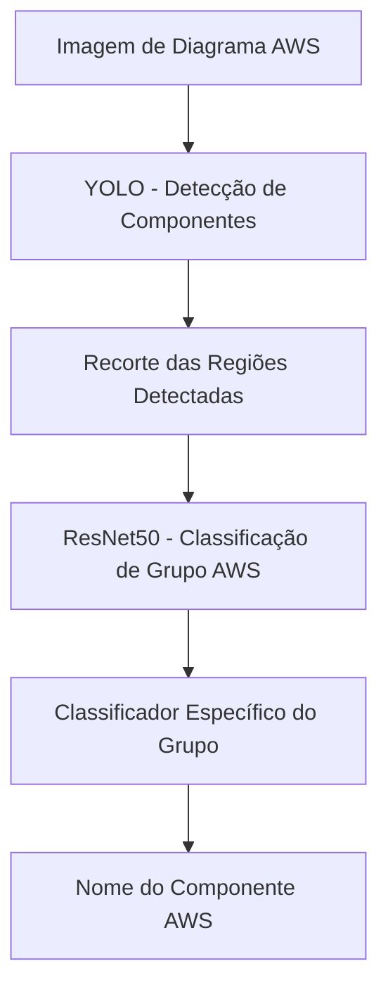

# Pipeline de Classificação de Componentes AWS

O pipeline realiza três etapas principais:

1. **Detecção**: Utiliza YOLO para detectar regiões de interesse (componentes) na imagem.
2. **Classificação de Grupo**: Cada região detectada é classificada em um grupo principal da AWS usando um classificador ResNet50.
3. **Classificação Específica**: Dentro do grupo identificado, um classificador específico (por exemplo, outro modelo ou lógica) determina o componente exato da AWS.

## Diagrama do Pipeline

## Resumo das Etapas
- **YOLO**: Localiza todos os componentes na imagem.
- **ResNet50**: Diz a qual grupo principal da AWS pertence cada componente detectado (ex: Compute, Storage, Analytics, etc).
- **Classificador Específico**: Refina a classificação dentro do grupo (ex: EC2, Lambda, S3, etc).

> O pipeline é modular e permite trocar facilmente o classificador de grupo (ex: MobileNetV2 ou ResNet50) usando o padrão Strategy.
